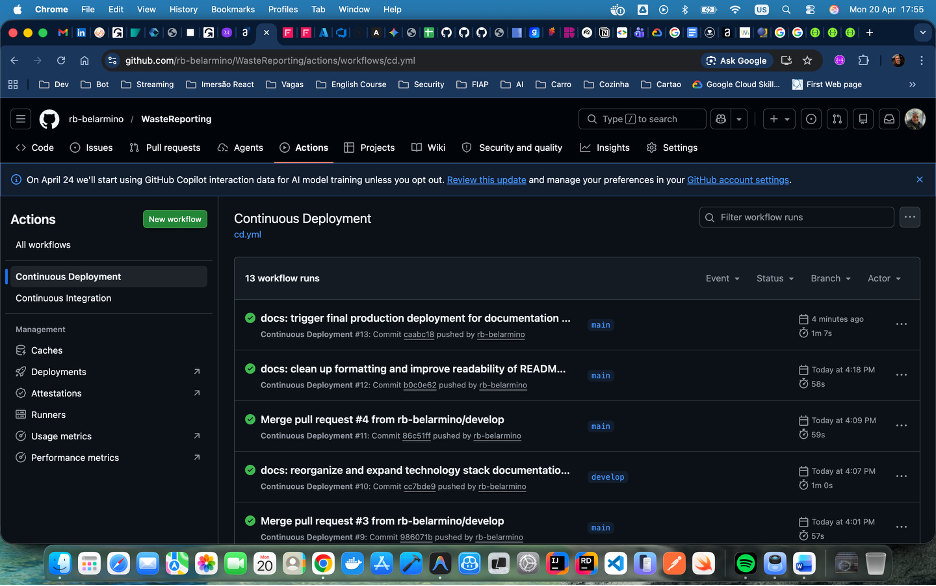
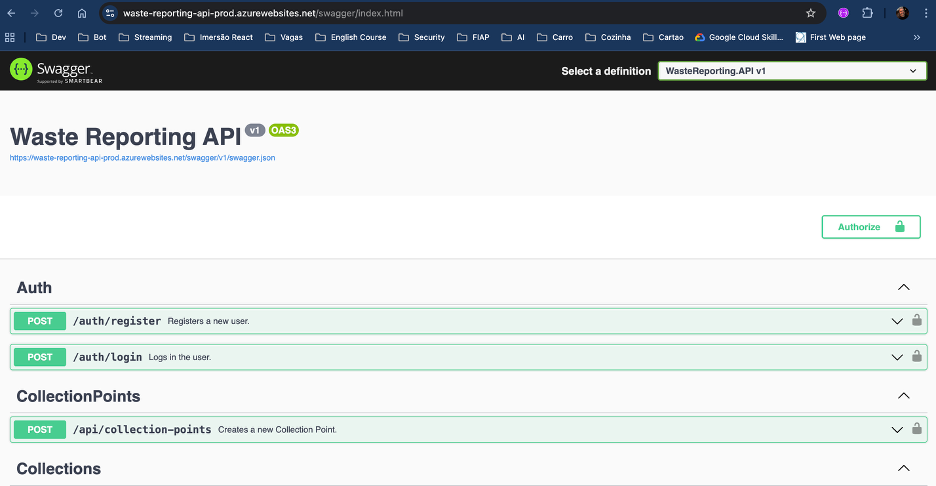
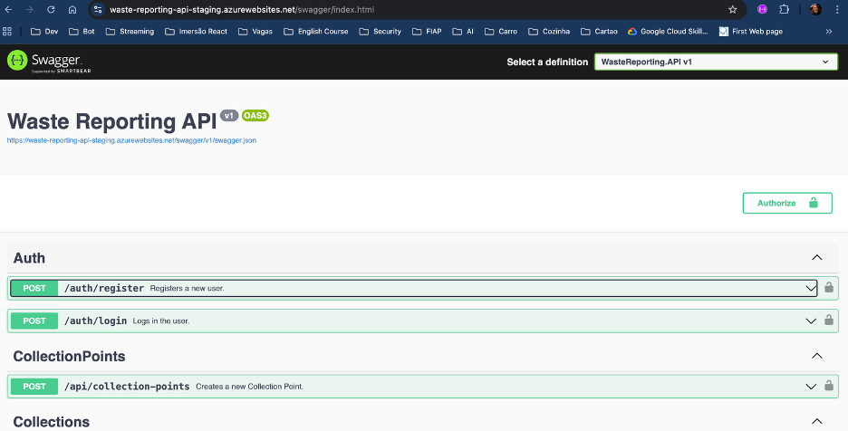

# Projeto - Cidades ESG Inteligentes (Waste Reporting API)

API RESTful desenvolvida em .NET 9 para gestão de denúncias de descarte irregular de resíduos, visando promover cidades mais sustentáveis (ESG).

## 🐳 Como executar localmente com Docker

Para subir a aplicação localmente, há dois arquivos `docker-compose` disponíveis:

### 1. Aplicação Principal (`docker-compose.yml`)
Sobe a aplicação juntamente com suas dependências de produção (como o banco de dados Oracle).
1. Certifique-se de ter o Docker instalado.
2. Ajuste as variáveis no `.env` (opcional).
3. Execute na raiz:
   ```bash
   docker compose up --build
   ```
4. Acesse a API em `http://localhost:5001/swagger`.

### 2. Ambiente de Testes Automatizados (`docker-compose.test.yml`)
Sobe a aplicação utilizando um banco de dados em memória e executa automaticamente a bateria de testes BDD (SpecFlow).
1. Execute na raiz:
   ```bash
   docker compose -f docker-compose.test.yml up --build --abort-on-container-exit
   ```
2. Acompanhe os cenários passando com sucesso no console do container `bdd-tests`.

## 🚀 Pipeline CI/CD

O projeto utiliza **GitHub Actions** para automação de processos, dividido em dois workflows principais:

- **CI (Integração Contínua)**:
  - Executado em cada Pull Request para as branches `main` e `develop`.
  - Realiza o **Build** da solução.
  - Executa os **Testes Automatizados** (xUnit).
  - Gera os artefatos de publicação (Publish).
- **CD (Entrega Contínua)**:
  - Executado em pushes para as branches `main` (Produção) e `develop` (Staging).
  - Chama o workflow de CI para garantir a integridade.
  - Realiza o **Deploy** automático para o **Azure Web App**.

## 📦 Containerização

A aplicação foi containerizada utilizando uma estratégia de **Multi-stage Build** no `Dockerfile`, o que reduz o tamanho final da imagem e aumenta a segurança ao não incluir o SDK no ambiente de execução.

**Conteúdo do Dockerfile:**

- **Base**: Utiliza a imagem `aspnet:9.0` para o runtime.
- **Build**: Utiliza a imagem `sdk:9.0` para compilar o código e restaurar dependências.
- **Publish**: Gera os binários otimizados.
- **Final**: Copia apenas os binários para a imagem de runtime.

A orquestração via **Docker Compose** permite configurar variáveis de ambiente, portas de rede e volumes de forma centralizada.

## 📸 Prints do funcionamento

### 1. Pipeline CI/CD (GitHub Actions) Sucesso


### 2. Ambiente de Produção (Swagger)


### 3. Ambiente de Staging (Swagger)


## 📁 Estrutura do Projeto

```text
/
├── .github/workflows/  # Configurações do GitHub Actions (CI/CD)
├── src/                # Código-fonte do projeto
│   ├── WasteReporting.API/     # Projeto principal da API
│   └── WasteReporting.Tests/   # Projeto de testes automatizados
├── .env.example        # Exemplo de variáveis de ambiente
├── Dockerfile          # Configuração de containerização da API
├── docker-compose.yml  # Orquestração de serviços
└── WasteReporting.sln  # Solução do Visual Studio
```

## 🤖 Tecnologias utilizadas

### Stack Principal

- **Linguagem:** C#
- **Framework:** .NET 9 (Web API)
- **Banco de Dados:** Oracle Database (via Entity Framework Core 9)
- **Segurança:** JWT Bearer Authentication & BCrypt para hashing de senhas.

### Ferramentas & DevOps

- **Containerização:** Docker & Docker Compose
- **CI/CD:** GitHub Actions (Pipelines de integração e entrega)
- **Cloud Hosting:** Azure App Service (Web Apps para Linux)

### Testes & Qualidade

- **Unit Testing:** xUnit
- **Mocking:** Moq
- **BDD/API Testing:** SpecFlow, RestSharp, FluentAssertions, Newtonsoft.Json.Schema

## ✅ Qualidade e Testes Automatizados (BDD)

Este projeto implementa Testes Automatizados aplicando **Behavior Driven Development (BDD)** com Gherkin e SpecFlow, visando validar o comportamento da API e garantir a conformidade dos contratos via JSON Schema.

### Estrutura do Projeto de Testes (`WasteReporting.BDDTests`)
- `Features/`: Arquivos `.feature` contendo os cenários em Gherkin.
- `Steps/`: Definição dos passos em C# que mapeiam os cenários para chamadas HTTP.
- `Schemas/`: Arquivos JSON contendo a estrutura esperada das respostas da API.

### 📝 Matriz de Rastreabilidade (Desafio ESG)

| Requisito ESG | Funcionalidade Testada | Resultado Esperado |
| ------------- | --------------- | ------------------ |
| **Governança e Compliance** | `Auth.feature` e `Management.feature` | Acesso bloqueado para não-autenticados; Validação estrita do token JWT via Schema. Cadastros de entidades base protegidos. |
| **Gestão de Resíduos** | `Reports.feature` e `Collections.feature` | Relato de descarte irregular inserido com sucesso; Associações corretas entre coletas e resíduos reciclados. |
| **Rastreabilidade** | `Reports.feature` e `Collections.feature` | Auditoria, histórico de envios do cidadão listados corretamente e rastreio de coletas atualizadas pelo admin. |
